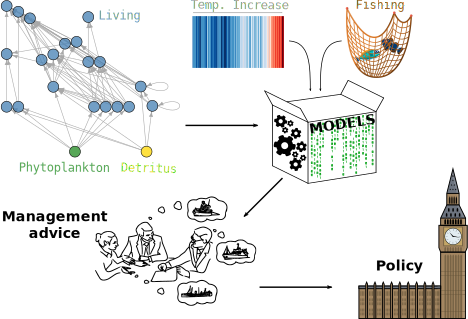

<link rel="stylesheet" href="https://cdnjs.cloudflare.com/ajax/libs/font-awesome/4.7.0/css/font-awesome.min.css">
```{r setup, include=FALSE}
knitr::opts_chunk$set(echo = FALSE)
```

## Structure of the talk

* What is it that I do?
  * Rationale
  * Current strategy
* What have I done so far?
  * `rep("debug",` $\infty$`)`
* Medium-term espectations

## Flash intro
<center>
```{r message=FALSE, warning=FALSE}

```
</center>
</br>
<p align="right">
<font size="2"><em>"all models are wrong, but some are useful" (<a href="https://www.sciencedirect.com/science/article/pii/B9780124381506500182">Box, 1979</a>).</em></font>
</p>

## Maximum Sustainable Yield
<center>
```{r message=FALSE, warning=FALSE, fig.height=1}
knitr::include_graphics("yield.svg")
```
</center>
<p align="right">
<font size="2">Modified from <a href="https://science.sciencemag.org/content/205/4403/267?casa_token=sxHj3fIlrlsAAAAA:sbeA6VQTkxzOMXnFf1zYHUiw8W0BLKVOcqTttpsHpcqV2t2gh6PO2OnDBjzWrijsn2EJH_EYDYmf2g">May <em>et al</em>., 1979</a>. <em>Science</em>, 205 (4403), 267-277.</font>
</p>

## Nash equilibrium?
<center>
```{r message=FALSE, warning=FALSE, fig.height=1}

```
</center>
</br>
</br>
<p align="right">
<font size="2">From <a href="https://academic.oup.com/icesjms/article/73/10/2499/2647108">Farcas, A. and Rossberg, A. G. 2016.</a>. <em>ICES J. Mar. Sci.</em>, 73 (10), 2499-2508.</font>
</p>

## Model selection
<center>
```{r message=FALSE, warning=FALSE, fig.height=1}

```
</center>
<p align="right">
<font size="2">To play around with the package go to <a href="https://github.com/NOAA-EDAB/Rpath"><i class="fa fa-github" style="font-size:24px"></i> NOAA-EDAB/Rpath</a>.</font>
</p>

## `Rpath` *vs* `ECOPATH`
<center>
```{r message=FALSE, warning=FALSE, fig.height=1}

```
</center>

## `Rsim` *vs* `ECOSIM`
<center>
```{r message=FALSE, warning=FALSE, fig.height=1}

```
</br>
&darr;
</br>
$\overline{Error(\%)}=-0.025$ with no external abiotic forcing (*e.g.* fishing effort or egg production time series).
</center>
## Medium term goals

* To wrap a 2<sup>nd</sup> functional iteration of the `Rpath` package;
* To compute NE MSY solutions for the North Sea ecosystem with `Rpath2 (ecopaRth?)` to assess tradeoffs between current management practices (*i.e.* single species management) and the so-called Ecosystem-Based Fisheries Management to ultimately find optimal mixtures of stocks; and
* To, perhaps, evaluate the predictability of these optima and their required management intensity taking into consideration inherent uncertainties.

</br>
<p id="demo"></p>

<script>
// Set the date we're counting down to
var countDownDate = new Date("Sept 22, 2023 00:00:00").getTime();

// Update the count down every 1 second
var x = setInterval(function() {

  // Get today's date and time
  var now = new Date().getTime();

  // Find the distance between now and the count down date
  var distance = countDownDate - now;

  // Time calculations for days, hours, minutes and seconds
  var days = Math.floor(distance / (1000 * 60 * 60 * 24));
  var hours = Math.floor((distance % (1000 * 60 * 60 * 24)) / (1000 * 60 * 60));
  var minutes = Math.floor((distance % (1000 * 60 * 60)) / (1000 * 60));
  var seconds = Math.floor((distance % (1000 * 60)) / 1000);

  // Display the result in the element with id="demo"
  document.getElementById("demo").innerHTML = "<b>Submission countdown:</b> " + days + " <sub>Days</sub> " + hours + " <sub>Hours</sub> " + minutes + " <sub>Minutes</sub> " + seconds + " <sub>Seconds</sub> ";
  document.getElementById("demo").style.color = "black";
  // If the count down is finished, write some text
  if (distance < 0) {
    clearInterval(x);
    document.getElementById("demo").innerHTML = "EXPIRED";
  }
}, 1000);
</script>